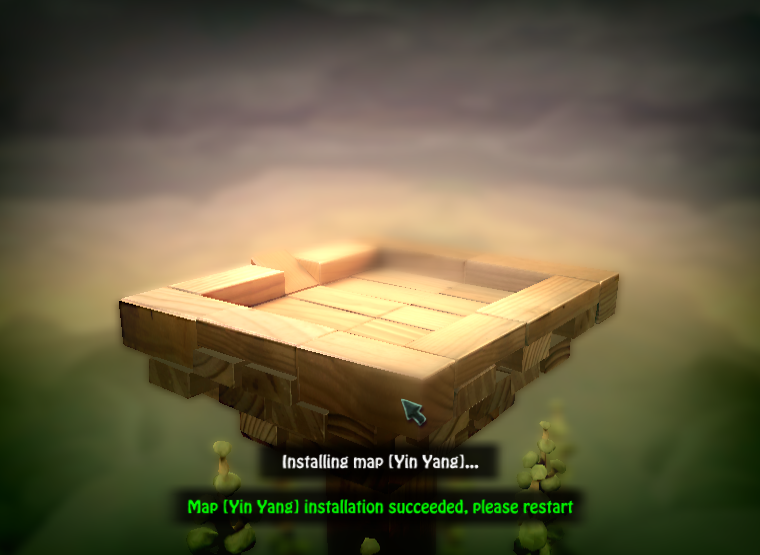

# BombSquad地图安装器

* 本项目旨在方便BombSquad的地图MOD作者发布他们的作品
* 你可以用这个项目在Android, Windows, MacOS, Linux全平台发布你的地图
* _[BombSquad](http://www.froemling.net/apps/bombsquad)是[Eric Froemling](http://www.froemling.net/about)创作的一款游戏_
* [English Version Here](README.md)

# 使用手册

1. 将你之前写在bsMap.py中的地图代码提取出来作为```bsNewMap.py```, 请不要再修改bsMap.py。
提取出来的代码应该和下边的样例相似
```python
# coding=utf-8
from bsMap import *  # 别漏加这一行


class yourMapWhateverTheName(Map):
    # 你的地图类，名称随意
    pass


registerMap(yourMapWhateverTheName)
# 在游戏中注册你的地图
```

2. 把你的地图所需要的所有文件放在一个新文件夹，比如"mapHello", 请注意不要在此文件夹下建立子目录。 
应当被放进去的文件包括：
    * ```*.bob``` 地图模型文件
    * ```*.cob``` 地图碰撞模型文件
    * ```*Defs.py``` 地图的点定义文件 
    * ```bsNewMap.py``` 和前边1.描述相同的文件

3. 复制一份```installer.py```，名字任意比如说```installYourMap.py```。
确保你当前的目录结构如下所示
```
+ 任意目录
|
+---- installYourMap.py
|
+---- mapHello
```

4. 修改```installYourMap.py```文件中前几行的大写字段
    * ```NEW_MAP_DIRECTORY``` 目录名称，在这个例子中应该是mapHello
    * ```NEW_MAP_NAME``` 地图名称，如果使用中文请确保不要删掉前导u，比如u'测试地图'
    * ```SUPPORTED_PLATFORMS``` 一个列表，包含你的地图所支持的平台
        * ```android``` 地图支持Android (含有 .ktx 纹理文件)
        * ```other``` 地图支持 Win, Linux, Mac (含有 .dds 纹理文件)

5. 复制```installYourMap.py```文件和```mapHello```文件夹到BombSquad的MOD目录，
重启游戏，如果一切顺利，你就可以发布了！


_样例请参考[samples](samples)文件夹_

# 作者

* __[spdv123](https://github.com/spdv123)__

# 如何贡献

1. Fork 项目
2. 修改```installer.py```
3. 提交Pull Request

# 开源许可

```
This is free and unencumbered software released into the public domain.

Anyone is free to copy, modify, publish, use, compile, sell, or
distribute this software, either in source code form or as a compiled
binary, for any purpose, commercial or non-commercial, and by any
means.

In jurisdictions that recognize copyright laws, the author or authors
of this software dedicate any and all copyright interest in the
software to the public domain. We make this dedication for the benefit
of the public at large and to the detriment of our heirs and
successors. We intend this dedication to be an overt act of
relinquishment in perpetuity of all present and future rights to this
software under copyright law.

THE SOFTWARE IS PROVIDED "AS IS", WITHOUT WARRANTY OF ANY KIND,
EXPRESS OR IMPLIED, INCLUDING BUT NOT LIMITED TO THE WARRANTIES OF
MERCHANTABILITY, FITNESS FOR A PARTICULAR PURPOSE AND NONINFRINGEMENT.
IN NO EVENT SHALL THE AUTHORS BE LIABLE FOR ANY CLAIM, DAMAGES OR
OTHER LIABILITY, WHETHER IN AN ACTION OF CONTRACT, TORT OR OTHERWISE,
ARISING FROM, OUT OF OR IN CONNECTION WITH THE SOFTWARE OR THE USE OR
OTHER DEALINGS IN THE SOFTWARE.

For more information, please refer to <http://unlicense.org>
```